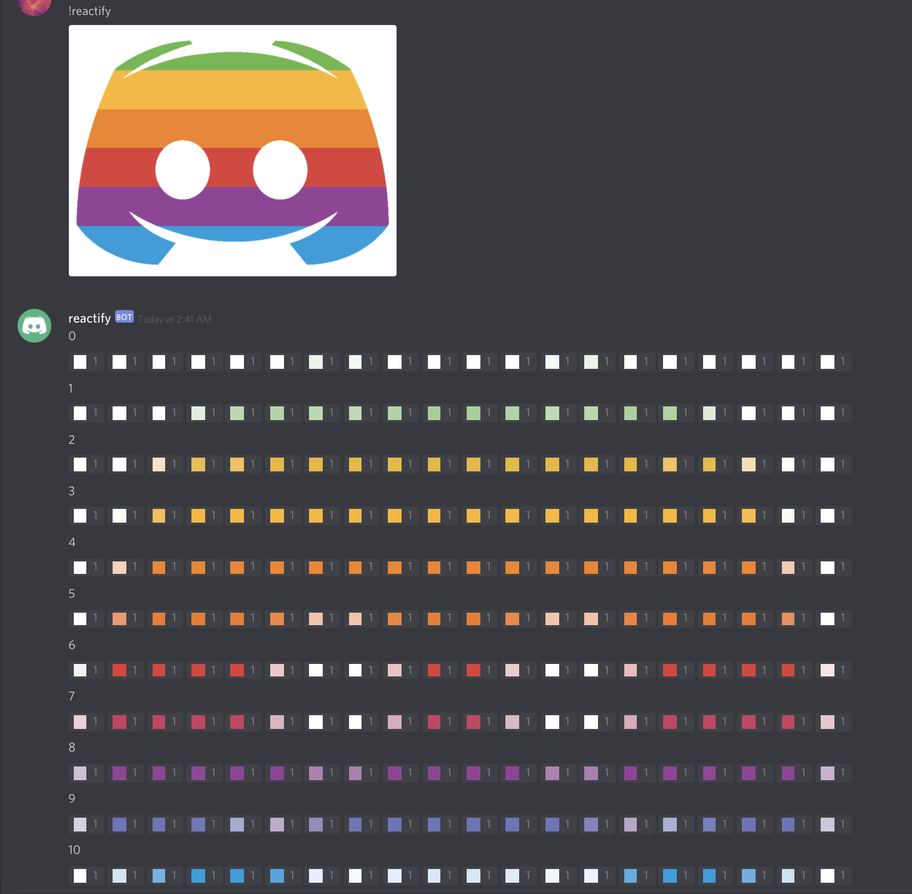

# Reactify

Reactify reactifies images - this Discord bot converts a given image into a series of messages with reactions attached to them, recreating the image!

## Usage

Clone the repo, make your pipenv, and pip install -r requirements.txt, insert your token, and enjoy!

Note that you must host this on your own server - otherwise, Discord limits would prevent the bot from functioning properly

## How It Works

The bot first breaks up the image into chunks, reads the average RGB value of the chunk, then creates a custom emoji in a server to represent that chunk. Then, the bot reacts to its message with that custom emote, and this process then repeats until the full image is "rendered" as reactions.

Example of this process:

This process tends to work best with low-detail images - because Reactify takes average RBG values, small details are often lost.

There can be some cutoff and stretching due to rounding.

## TODO

- [ ] Take URLs in addition to attachments
- [ ] More support for different resolutions
- [ ] More robust cleaning methods

## Contributing

This was written quickly and badly - I'll be open to any pulls, if there is any interest.

Created by Vex#9042

:)
